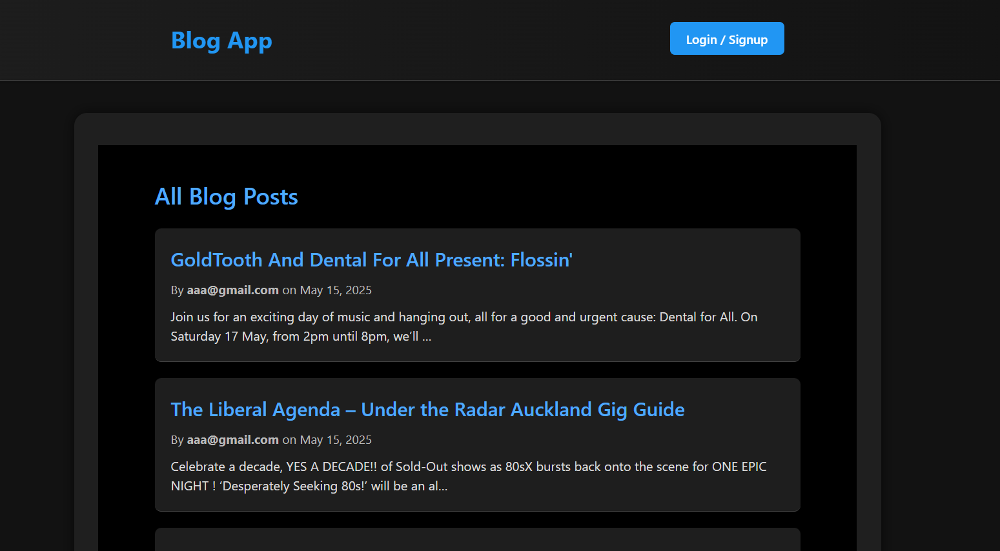
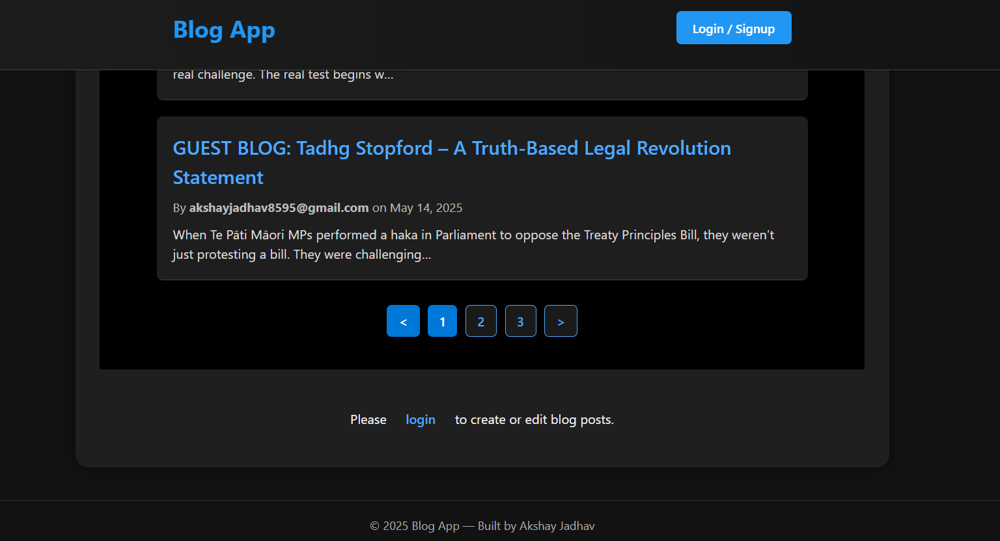
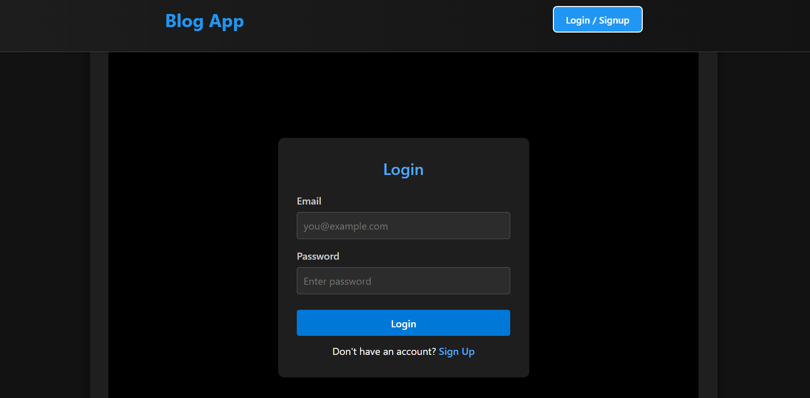

# 📝 Blog App

A simple, elegant, and fully frontend-powered Blog Application built using **React.js**. This app allows users to create, view, and manage blog posts using localStorage — making it ideal for learning React fundamentals, state management, and routing, all without the need for a backend.

---

## 🚀 Features

- 🧑‍💻 User Login (stored in `localStorage`)
- ➕ Create new blog posts
- 📜 View all blog posts
- 👀 Read individual blog posts in detail
- 🗂 Filter blogs by user
- 🖤 Dark theme UI
- 📱 Fully responsive and mobile-friendly layout

---

## 🛠️ Tech Stack

| Layer        | Technology                      |
|--------------|----------------------------------|
| **Frontend** | React.js, HTML, CSS *(or Tailwind CSS / Bootstrap if used)* |
| **Routing**  | React Router                    |
| **State**    | React Hooks (`useState`, `useEffect`) |
| **Storage**  | localStorage                    |

---

## 📸 Screenshots

> Add your screenshots in the `assets/screenshots/` folder and link them below:

### Homepage
- 
### Login/SignUp
- 
### Pagination
- 
### Create Post
- 

---

## 📦 Installation

```bash
git clone https://github.com/AkshayJ9/Blog-App.git
cd Blog-App
npm install
npm start
